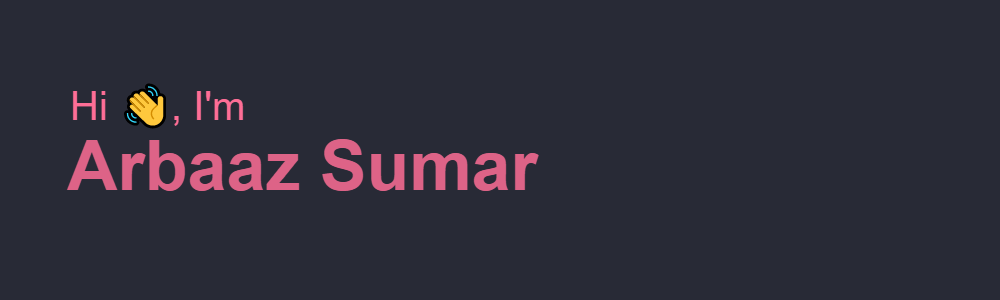

 

 

Front-End Engineer, active coder and avid dreamer. I make it my mission to translate user-focused designs into pixel-perfect websites or applications that run blazing fast.

Want to know more about me? [Check out my portfolio.](http://arbaazsumar.com/)

More Skills

 

 

 

